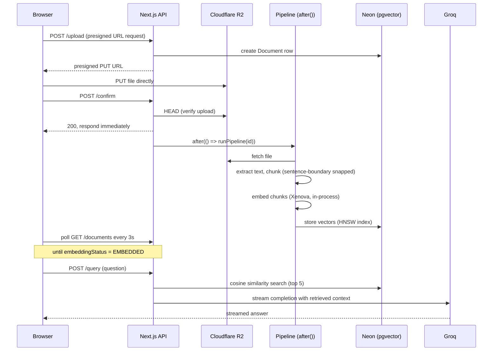

# StudyVault

A RAG (Retrieval-Augmented Generation) pipeline built from scratch: upload a document, it gets chunked and embedded locally, and you chat with it grounded in real retrieved context. The kind of machinery that sits under every "chat with your PDF" product, rebuilt to actually understand it — end to end, in TypeScript.

**Live demo:** [studyvault-amber-iota.vercel.app](https://studyvault-amber-iota.vercel.app)

> Runs on free-tier infra. A keep-warm ping keeps the database awake, so cold starts should be rare — but this is a zero-budget deploy, not a production SLA.

### System architecture


## The 30 second version

- Embeddings run **in-process** via `@xenova/transformers` (ONNX, CPU) — no external embedding API, no quota, no per-token cost.
- Chat completions stream from **Groq** (`openai/gpt-oss-120b`), swapped in after burning through Gemini and OpenAI free-tier quotas during development.
- Vector search is **pgvector with an HNSW cosine index** on Neon Postgres — top-5 retrieval per question.
- Document ingestion runs as a **true background job** via Next.js `after()`, so the upload confirmation returns instantly instead of blocking on a 20+ second pipeline.
- Hard per-account limits (files, chat turns per file, character counts) are enforced **server-side**, not just in the UI.
- Packed onto **free-tier infra everywhere** — Vercel, Neon, Cloudflare R2, Groq — that costs nothing at rest.

## How a document becomes queryable



The upload confirmation never waits on the pipeline. `after()` lets the HTTP response return in under a second while extraction, chunking, embedding, and vector storage happen afterward — the browser finds out via polling, not by holding a connection open.

## Tech, and why

| Layer           | Tech                                                 | Why                                                                                                                              |
| --------------- | ---------------------------------------------------- | -------------------------------------------------------------------------------------------------------------------------------- |
| Framework       | Next.js 16 (App Router), TypeScript                  | One codebase for UI, API routes, and background work.                                                                            |
| Auth            | Auth.js (NextAuth), Google OAuth, JWT                | No session table round-trip needed on every request.                                                                             |
| Database        | Neon Postgres + pgvector, Prisma                     | Serverless Postgres with vector search built in — no separate vector DB to run.                                                  |
| File storage    | Cloudflare R2, presigned URLs                        | Browser uploads straight to storage; the server never proxies file bytes.                                                        |
| Embeddings      | `@xenova/transformers`, `all-MiniLM-L6-v2` (384-dim) | Runs in-process — no external API, no rate limit, no per-request cost. Swapped in after exhausting Gemini and OpenAI free tiers. |
| Chat model      | Groq, `openai/gpt-oss-120b`                          | Fast inference, generous free tier, OpenAI-compatible SDK.                                                                       |
| Validation      | Zod                                                  | Every request body validated at the boundary.                                                                                    |
| Text extraction | `pdf-parse`, `mammoth`                               | PDF and DOCX support without a headless browser.                                                                                 |

## A few decisions I would call out

- **Moved embeddings in-process instead of chasing another API.** After burning through free-tier quota on two different embedding providers during testing, the fix wasn't a bigger quota — it was removing the external dependency entirely. Xenova trades a few hundred milliseconds of CPU time for zero rate limits, which is the right trade for a project this size.
- **The background pipeline uses `after()`, not a naive fire-and-forget.** A bare non-awaited async call risks the serverless function freezing the instant the HTTP response is sent. `after()` is the platform-sanctioned way to say "keep this invocation alive until this finishes," which a raw `void runPipeline(id)` does not guarantee.
- **A keep-warm cron pings the database, not the app.** Neon's free tier suspends its compute after 5 minutes of inactivity; a scheduled `SELECT 1` every ~4 minutes keeps it from ever going idle. This is a workaround for a specific free-tier constraint, not a substitute for provisioned compute — worth saying explicitly rather than presenting it as a real fix.

## Edge cases handled

A client disconnecting or timing out mid-stream no longer crashes the server (`ReadableStream.cancel()` catches it instead of throwing on a closed controller). The Groq retry loop only retries before any output has reached the client, so a transient failure can't produce a duplicated, garbled answer. A document's chat history is scoped to its owner at the database query level, not checked after the fact. Xenova's model cache is redirected to `/tmp` since Vercel's filesystem is read-only everywhere else, and a failed model load no longer poisons every future request with a cached rejected promise. Native binary dependencies (`onnxruntime-node`, `pdfjs-dist`'s worker, `@napi-rs/canvas`) needed explicit file-tracing config to survive Vercel's bundler at all.

## Run it locally

Needs Node 22+, a Neon (or any Postgres + pgvector) database, and a Cloudflare R2 bucket.

```bash
npm install
# set DATABASE_URL, GROQ_API_KEY, R2 credentials, GOOGLE_CLIENT_ID/SECRET, AUTH_SECRET (see .env.example)
npx prisma generate
npx prisma migrate deploy
npm run dev
```

## Known limits

Per-file limits (max 2 questions, max 4 files) count client-saved messages and reset if you delete and re-upload a file — a persistent per-account cap would be the production-grade version. Retrieval doesn't specially handle tables, diagrams, or code blocks inside source documents; text extraction flattens them, so answers about tabular data lean on prose summary rather than exact reproduction. Upload size is validated client-side but not enforced on the storage layer itself. This is a demo built to show the pipeline end to end, not a hardened multi-tenant product.

## Repo layout

```
src/
  app/            routes (pages + API)
  components/     chat UI (composer, transcript, sidebar)
  lib/            pipeline, embedding, answers, search, r2, auth
  scripts/        one-off/maintenance scripts
prisma/
  schema.prisma   Document, DocumentChunks, Messages, User
  migrations/
```
